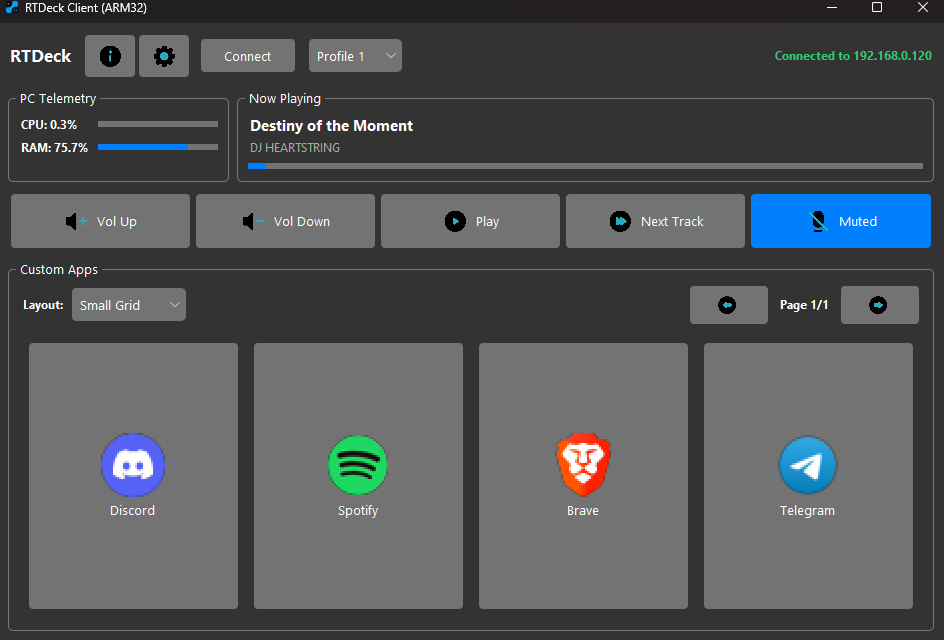
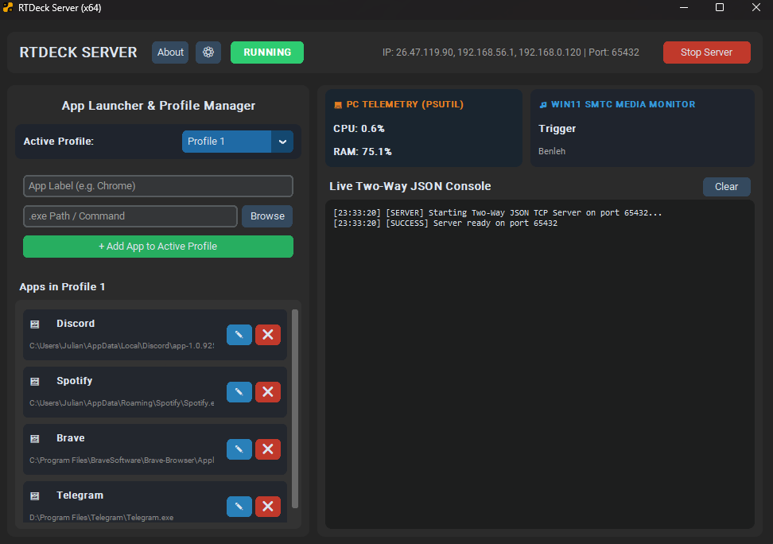

# RTDeck 🚀

**A Lightweight, Two-Way Stream Deck Clone for Windows 11 (x64) and Windows RT / ARM32 Devices.**

[](https://python.org)
[]()
[](LICENSE)

📦 **[Download Latest Compiled Releases (x64 Server & ARM32 Client)](https://github.com/juliancz-a/RTDeck/releases)**

---

## User Interface

| ARM32 Tablet Client UI | x64 PC Server Control Panel |
| :---: | :---: |
|  |  |

---

## 🌟 About the Project

**RTDeck** is a simple, two-way macro pad and Stream Deck clone system built entirely in Python. It pairs a **Windows 11 (x64) PC Server** with a **Windows RT 8.1 (ARM32) Tablet Client** (such as the original Microsoft Surface RT) over local TCP/IP sockets.

### 💡 Motivation & Architecture
Many Surface RT and Windows RT tablets sit unused due to the operating system's strict ARM32 restrictions and lack of C++ compilation tools on the device. **RTDeck breathes new life into legacy ARM32 hardware** by transforming low-resource touchscreens into powerful, modern Stream Decks without heavy web frameworks, Node.js, or Electron bloat.

- **Client (`src/client_arm32.py`)**: Runs on pure standard Python + built-in `tkinter`/`ttk` styled with the **Azure Dark/Light TCL theme**. It features zero C++ binary dependencies, native Base64 PNG image decoding, local icon rendering, dynamic layout views (Small Grid, Large Grid, List View), and 5 profile slots.
- **Server (`src/server_x64.py`)**: Runs a **CustomTkinter** GUI on Windows 11 PC. It extracts native `.exe` icons via Windows GDI, downsamples them with PIL LANCZOS, controls hardware media actions (Volume, Play/Pause, Next Track, Microphone Mute), monitors CPU/RAM telemetry via `psutil`, and reads active media playing via Windows 11 SMTC.

---

## 🛠️ Prerequisites & Installation

### 1. Main PC Server (x64 Windows 10/11)
Requires **Python 3.10+**. Install the server dependencies via `pip`:

```bash
pip install customtkinter Pillow pyautogui psutil pywin32 pycaw comtypes winsdk pywinstyles
```

### 2. Tablet Client (ARM32 / Windows RT 8.1)
The ARM32 client uses **pure standard Python library** modules (`socket`, `threading`, `queue`, `json`, `tkinter`, `ttk`). It requires **no external C++ compiled packages** (like Pillow or CustomTkinter).
> 🔓 **Windows RT 8.1 Jailbreak Requirement**:
> Your ARM32 Windows RT device **must be Jailbroken** (Secure Boot test-signing enabled) to execute non-signed third-party applications or compiled binaries.
> 🔗 **[Read the Tegra Jailbreak USB Guide for Windows RT](https://windows-rt-devices.gitbook.io/windows/tools/tegra-jailbreak-usb)**

> 📦 **Portable Python 3.12.4 for Windows RT (ARM32)**:
> Download the pre-packaged portable bundle containing Python 3.12.4, compiled dependencies, PyInstaller, and the ARM32 bootloader directly from the Open-RT repository:
> 🔗 **[Download Python 3.12.4 ARM32 Bundle (7z)](https://files.open-rt.party/Software/dev/Python312-arm32.7z)**

---

## 🔨 Compiling Executables (PyInstaller)

Both client and server support PyInstaller `--onefile` bundling. Configuration files (`config.json`, `client_prefs.json`, `server_prefs.json`) are automatically stored next to the executable (outside the temporary `_MEIPASS` folder).

### Build Windows RT Client Executable (`client_arm32.exe`)
Run from the repository root:

```cmd
pyinstaller --noconsole --onefile --icon="src/RTDeck.ico" --add-data "src/azure.tcl;." --add-data "src/theme;theme" --add-data "src/icons;icons" --add-data "src/lang.json;." --add-data "src/RTDeck.ico;." src/client_arm32.py
```

### Build Windows 11 PC Server Executable (`server_x64.exe`)
Run from the repository root:

```cmd
pyinstaller --noconsole --onefile --icon="src/RTDeckServer.ico" --add-data "src/server_lang.json;." --add-data "src/RTDeckServer.ico;." src/server_x64.py
```

---

## 🚀 Quick Start Guide

1. **Launch Server on Main PC**:
   ```bash
   cd src
   python server_x64.py
   ```
   Note down the IPv4 address shown in the header (e.g., `192.168.1.15`).

2. **Launch Client on Tablet**:
   ```bash
   cd src
   python client_arm32.py
   ```

3. **Connect Client to PC**:
   - Click the **Connect (`Connect` / `📡`)** button in the tablet header.
   - Enter your PC's IPv4 address and Port (`65432`). Click **Connect**.

4. **Configure Custom App Launchers**:
   - On your PC Server GUI, enter an App Label (e.g. `Chrome`), browse to its `.exe` path, and click **+ Add App to Active Profile**.
   - The native icon is automatically extracted, downsampled, converted to Base64, and instantly pushed to the tablet screen.
   - Switch between **Profile 1** through **Profile 5** on either PC or tablet for seamless profile management!

---

## ⚙️ Features at a Glance

- 🎛️ **5 Bidirectional Profile Slots**: Instant TCP synchronization between server and client.
- 🎯 **Smart "Focus or Launch" Logic**: Restores and brings existing window to front (`SetForegroundWindow`) if already running; launches natively if closed.
- 🔗 **Native `.lnk` Shortcut Support**: Full support for `.lnk` Windows shortcuts (auto-resolves target `.exe` for icons and preserves shortcut launch routines).
- 📱 **Jumbo Touch Targets**: Optimized touch grid sizes (Small Grid, Large Grid, List View).
- 🖼️ **Native High-Res Icon Extraction**: PyWin32 GDI extraction with LANCZOS downsampling.
- 🌐 **i18n Multi-Language System**: Dynamic English (`en`) and Spanish (`es`) localization via `lang.json` and `server_lang.json`.
- 💾 **Persistent Settings**: Auto-restores Theme, Language, Fullscreen mode, and Last IP/Port from `client_prefs.json` and `server_prefs.json`.
- 🎨 **Azure Dark/Light Theme**: Sleek modern aesthetics designed by rdbende.
- 🎵 **Windows 11 SMTC Media Monitor**: Real-time track title, artist, and playback progress monitoring.

---

## 🤝 Credits & Acknowledgements

- **Author & Developer**: **Julián Caceres** ([GitHub Profile](https://github.com/juliancz-a))
- **UI Theme**: **[Azure-ttk-theme](https://github.com/rdbende/Azure-ttk-theme)** by [rdbende](https://github.com/rdbende)
- **ARM32 Software & Development Tools**: Open-RT Community ([files.open-rt.party](https://files.open-rt.party)) for providing the compiled Python port for ARM32 Windows RT. Join the community on **[Open-RT Discord](https://open-rt.party/discord)**.
---

## 📄 License

This project is released under the [MIT License](LICENSE).
